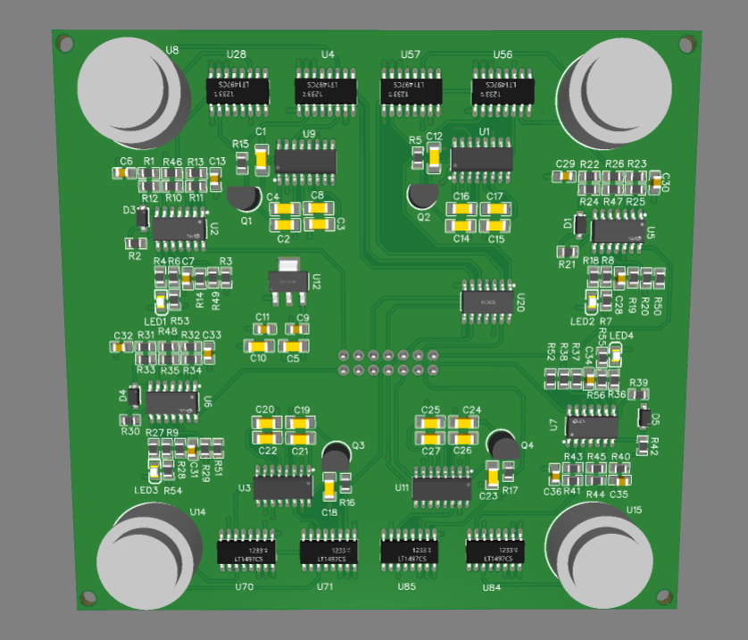
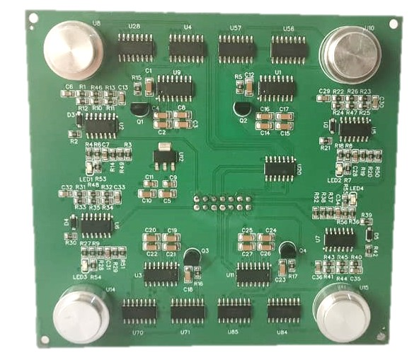

# Space Modulated Acoustic Communication System

## Overview
This project presents the design and implementation of a **Space Modulated Acoustic Communication System** based on Space Shift Keying (SSK) and Time Difference of Arrival (TDOA) techniques.  
It was developed as part of my Bachelor’s Thesis at the German Jordanian University, under the supervision of Dr. Omar Hiari.

The main objective of this work is to achieve low-complexity, reliable, and energy-efficient communication using ultrasonic transducers.  
Instead of encoding data in the waveform, the system encodes information in the spatial position of the active transmitter, a technique known as **Space Modulation**.

A custom PCB was designed and fabricated to facilitate experimentation and testing of the communication setup.

---

## ⚙️ Key Features
- **4×4 Ultrasonic Transducer Array** for signal transmission and reception.  
- **Arduino UNO** on the transmitter side to generate 5V TTL signals.  
- **ESP32 Microcontroller** on the receiver side for high-precision timestamping.  
- **TDOA-based Detection** to identify the active transmitter.  
- **2×2 Data Transmission** proof-of-concept with 0% error rate at 40 cm.  
- **Custom PCB Design** implemented using EasyEDA.  
- **Future Extensions:** 4×4 data transmission and underwater communication.

---

## 🧩 System Design Summary

### 🔧 Hardware
- **Transmitter:** MAX232 IC for TTL to RS-232 level conversion, improving signal amplitude.  
- **Receiver:** LM324-based amplifier and comparator circuit for signal detection.  
- **Multiplexer:** HCF4051 to switch between transmit and receive modes.  
- **Voltage Regulation:** AMS1117 for a stable +5V supply.  
- **Microcontrollers:** Arduino UNO (Tx) and ESP32 (Rx).

### 💻 Software
- **Circuit & PCB Design:** EasyEDA  
- **Firmware Development:** Arduino IDE (C/C++)  
- **Signal Detection:** Hardware interrupts and timers on ESP32 for precise TDOA measurement.

---

## 📊 Results
✅ Verified TDOA detection and spatial modulation using custom-designed PCBs.  
✅ Successfully demonstrated 2×2 data transmission using space modulation techniques.  
✅ Established a foundation for underwater acoustic data transmission experiments.

---
## 🚀 Future Work
- Implement a **4×4 Data Transmission** to increase data throughput.  
- Test the system in **underwater environments**.   

---

## 📂 Media & Resources

- 📄 **Project Report (PDF):** [View Full Thesis](docs/project_report.pdf)  
- 🎥 **2×2 Data Transmission Video Demo:** [Watch Here](#)  
- 🖼️ **PCB Image (Fabricated):**  
  
